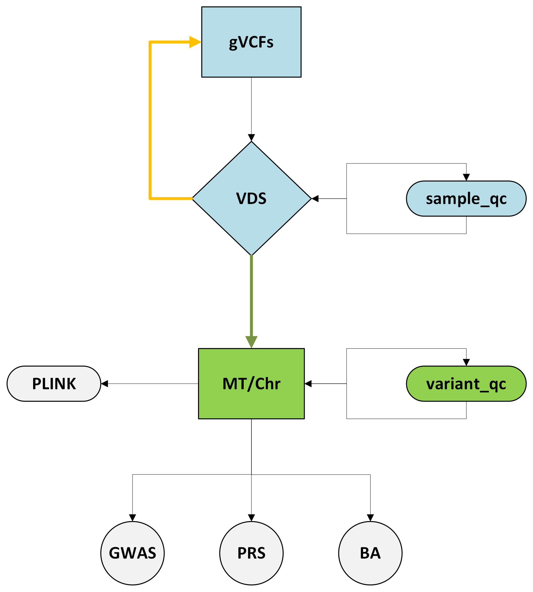

# Hail
Merge gVCF files into a new or existing VDS and perform sample level QC (blue), partition VDS into MatrixTables by Chr with variant level QC (green) using Hail. 

gVCF-to-VDS Pipeline

This repository contains a Hail-based pipeline to merge a large number of gVCF files into a single Variant Dataset (VDS), compute sample-level QC, and persist the results.

Environment Setup
	1.	Clone the repository:

git clone [https://github.com/<your-org>/<your-repo>.git](https://github.com/ImperialCardioGenetics/Hail.git)
cd <your-repo>

	2.	Create the Conda environment:

conda env create --file environment.yml

	3.	Activate the environment:

conda activate hail

This installs Hail, its Spark dependencies, and any other Python packages needed by the pipeline.

Inputs
	•	test.txt: Plain text list of absolute paths to gVCF files (one per line).
	•	gVCF files: Ensure each has an accompanying .tbi index.

⸻

Running the Pipeline

Using the Python Script Directly
	1.	Ensure the Conda env is active:

conda activate hail

	2.	Edit gVCF_to_VDS.py to set your paths and parameters (see Configuration).
	3.	Run the script:

python gVCF_to_VDS.py

Submitting with PBS (qsub.sh)
	1.	Make sure qsub.sh is executable:

chmod +x qsub.sh

	2.	Submit to the scheduler:

qsub qsub.sh

	3.	Monitor job output in the files specified by #PBS -o and #PBS -e.

Outputs
	•	outputs/test.vds/: Directory containing the merged VDS.
	•	outputs/test_sample_qc.ht: Hail Table of per-sample QC metrics.

Inspect with:

import hail as hl
mt = hl.read_matrix_table('outputs/test.vds')
hl.read_table('outputs/test_sample_qc.ht').show()

⸻

Troubleshooting
	•	File handle limits: If you see “too many open files” errors, reduce gvcf_batch_size to ≤ your system’s ulimit.
	•	Memory errors: Adjust ram and ncpu to fit available nodes.
	•	Spark UI: Visit http://<driver-host>:4040 to monitor job stages.

